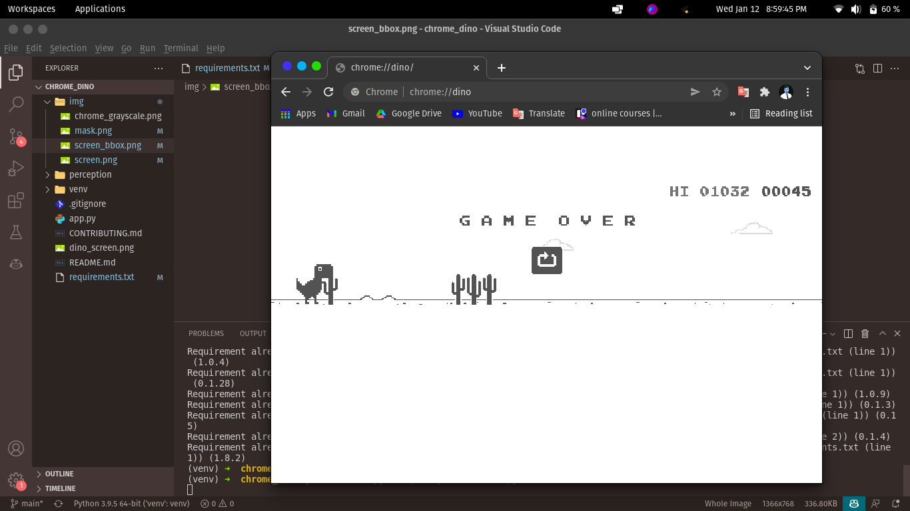
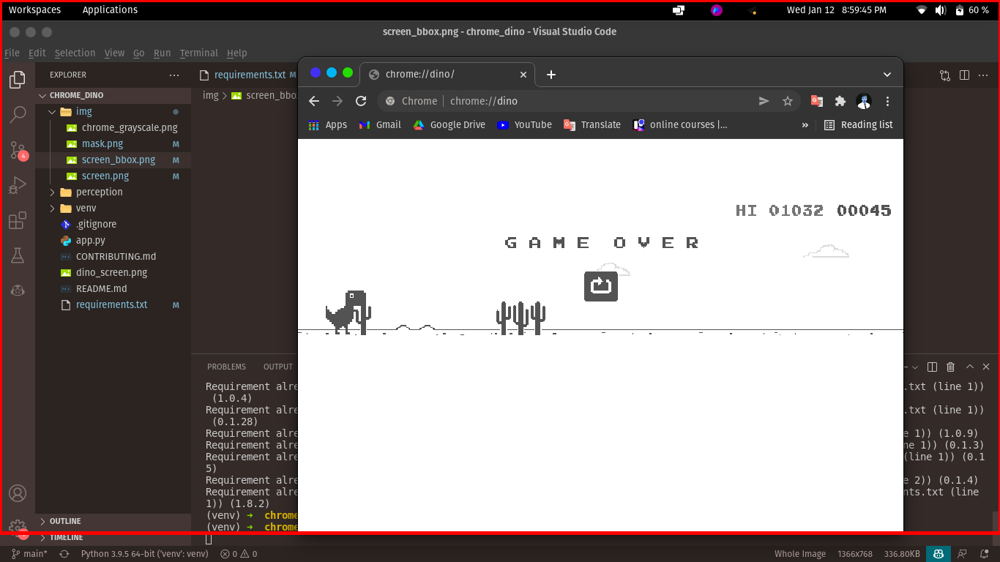

#chrome_dino
AI dino
## Introduction
### GIT CLONE
```bash
git clone https://github.com/codeschooluz/chrome_dino.git
```
- get screenshot
## Getting started

### Installing
```bash
pip install -r requirements.txt
```
## Contribute
  [how to contribute to open source](CONTRIBUTING.md)

## Screenshot
### Screenshot of the chrome dino game

### Get mask image

### Bounding box of region of interest
